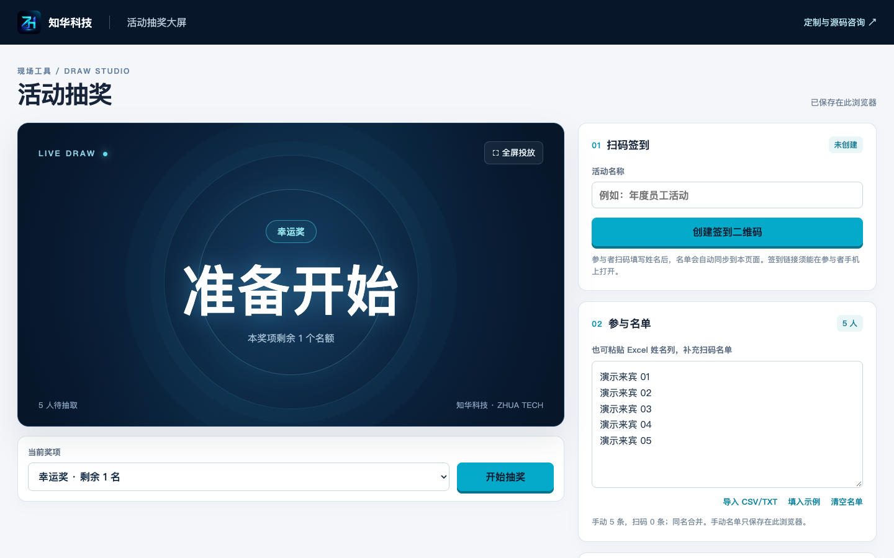
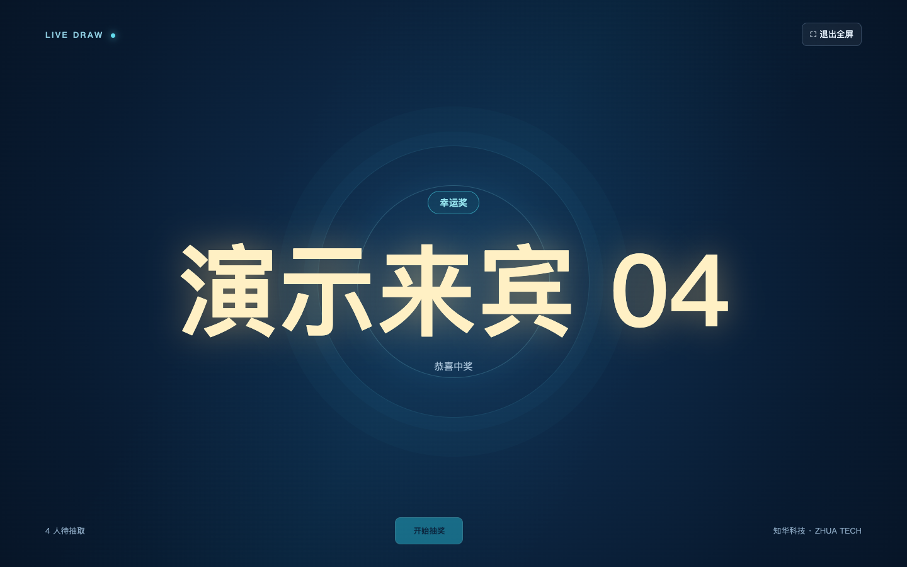
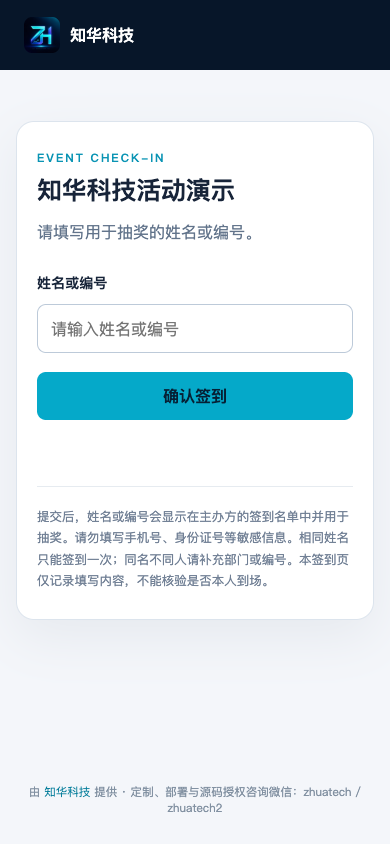

[中文](README.md) | [English](README.en.md)

# ZhiHua Event Lottery · QR Check-in and Event Draw Screen

**ZhiHua Technology (Shanghai Rujing Zhihua Information Technology Co., Ltd.)** · [Official website](https://www.zhuatech.cn/).

**Public source for learning 0.1.0 / non-commercial use.** HTML, CSS, JavaScript, Node.js and SQLite/D1-compatible interfaces provide organizer event setup, mobile attendee check-in, a shared draw pool, prize selection, fullscreen display and winner CSV. Organizers create a public check-in link; attendees enter a name or identifier rather than an organization account.

Own source is for individual learning, technical research and non-commercial exchange. The existing [LICENSE](LICENSE) and [NOTICE](NOTICE) require prior written company authorization for commercial use, including internal business production, independent commercial hosting, SaaS and paid delivery. This is not an OSI open-source license. Free use of the company's hosted tool does not grant commercial source rights. The bundled QR library keeps its own MIT terms in [third-party notices](dist/vendor/THIRD_PARTY_NOTICES.txt).

## Organizer and attendee workflow

1. Organizer enters an event name and creates its check-in QR/link. Export an activity backup immediately and keep it private; it contains the management credential.
2. Attendees open the link on a reachable phone and submit the name/identifier to use in the draw. The organizer polls the service every three seconds. Check-in records do not verify actual attendance or identity.
3. Close check-in when ready, reopening only when needed. Supplement the list with pasted Excel name columns or CSV/TXT. Use stable unique identifiers when different people share a name.
4. Configure prize names/quotas, select a prize, start the animation and stop to select a winner. Previously selected winners are excluded from subsequent draws. Prizes with results cannot be deleted or reduced below already awarded counts.
5. Use fullscreen for projection and export winner CSV. Back up updated local prize/list/results again. After the event, retain the required results and deliberately delete the server event/check-ins using its management credential.

These are event records and browser draw controls, without payment, prizes fulfillment, identity certification, notarization or regulatory certification. Organizers are responsible for their event rules, notice and data handling.

## Implemented functions and limits

| Area | Behavior |
| --- | --- |
| Public check-in | Event link, duplicate-name merging, open/close/reopen and at most 2,000 attendees |
| Organizer management | Independent random event credential; authenticated list/status/deletion, not a shared administrator login |
| Draw | At most 20 prizes, quota controls, nonrepeating winners and fullscreen display |
| Participant lists | Manual names/IDs, pasted Excel columns, CSV/TXT imports and merged check-in names |
| Background | Built-in themes or JPG/PNG/WebP up to 5 MB; position/dimming saved in the current browser only |
| Result export | Prize, name/identifier and draw time in CSV, without management credentials or inserted advertising |
| Activity backup | Local manual list, prizes, winners and event-management credential; validated restoration on the same site |
| Persistence | Server events/check-ins in SQLite or compatible D1 binding; local draw state remains in browser storage |

Remote check-in trims/case-normalizes names for duplicate detection; the combined manual/remote pool deduplicates exact displayed names. Use consistent identifiers. Neither the participant form nor the application verifies a real person's identity. Do not collect phone numbers, identity-document numbers or other unnecessary sensitive details.

Links expire 30 days after creation. Expired/deleted events cannot be managed or restored through an activity backup. Expiry blocks API access but does not implement scheduled physical deletion of old database rows; deployment operators must manage retention/cleanup. There is no role editor, departments, business dashboard or global administrator portal. The current application UI is Chinese; the English README documents that interface.

## Actual interface screenshots

The existing running views use fictional demonstration guests. They represent organizer console, fullscreen draw and mobile attendee form, rather than nonexistent login/permission pages.

The organizer console shows event-creation controls, a manual sample list and prize/draw controls.



| Fullscreen draw | Mobile attendee check-in |
| --- | --- |
|  |  |

The stage displays a fictional selected guest. The phone form submits a name/identifier to the event service; it does not establish identity.

## Hosted trial and network access

[Open the existing hosted tool](https://zhuatech-event-lottery.zhh260417.chatgpt.site/). Access to that host/check-in page depends on the participant's network and may not be direct in some environments. Test using the intended phone before an event. Self-hosting uses your own reachable domain and does not depend on the original trial platform. [Project consultation](https://www.zhuatech.cn/contact.html) is available for commercial authorization, custom visuals, deployment and integration.

## Architecture and directories

The organizer browser stores manual lists, prizes, winners and its event credential. The service stores events and scanned check-ins; only the credential's SHA-256 hash is stored in the database. The public link contains no management credential. Background images remain local and are not uploaded to the service.

```text
Organizer/attendee browser → same-origin Nginx gateway → Node worker + SQLite
                                                  or a compatible D1 DB binding
```

```text
dist/                  Organizer console, draw stage, join page and brand assets
  server/              Generated worker bundle, ignored by Git
worker/index.js        Event, check-in, participant and management API
worker/migrations/001_events.sql   Initial database tables
scripts/               Build, local server, SQLite adapter and release checks
tests/                 API, migration/transaction and activity-backup tests
deploy/nginx.conf      Same-origin gateway and health forwarding
Dockerfile / compose.yaml    Isolated service, gateway and persistent volume
.env.example           Bind addresses, ports and database path without secrets
docs/                  Chinese manual, actual screenshots and original contacts
LICENSE / NOTICE       Own-source and independent third-party terms
```

## Environment and local startup

Use Node.js 24.19+ for built-in HTTP, SQLite, crypto and test modules. No third-party npm runtime installation is required. From the repository root:

```sh
npm run dev
```

Open [http://127.0.0.1:4173/](http://127.0.0.1:4173/). The local server defaults to localhost and stores check-ins in `.local/events.sqlite`. A phone's own `127.0.0.1` is not the computer's preview. For external check-in deploy to an address reachable by participant phones; a private/local-only preview is insufficient.

A dedicated local test can choose a separate port/database:

```sh
env HOST=127.0.0.1 PORT=18189 DB_PATH=/path/to/private-test/events.sqlite npm run dev
```

The database path must be writable and private. This example is a placeholder path to replace with your own disposable test directory, not a production database. Node startup/build needs no real API key or shared password.

## Compose deployment and configuration

Docker builds use Node.js 24.19; the gateway uses Nginx 1.29 with Compose v2. From the root:

```sh
docker compose config --quiet
docker compose up --build -d --wait
```

Default public-facing local entry is `http://127.0.0.1:4173/`; change `WEB_PORT` for a conflict. Nginx proxies pages and `/api` on the same origin. The Node service stores SQLite in the `lottery_data` volume. Both service and gateway check `/health`; its database initialization must succeed for health to pass.

| Name | Meaning |
| --- | --- |
| `WEB_BIND_ADDRESS` / `WEB_PORT` | Compose gateway, default `127.0.0.1` / `4173` |
| `HOST` / `PORT` | Direct Node listening address/port, default `127.0.0.1` / `4173` |
| `DB_PATH` | Direct Node database file, default `.local/events.sqlite`; Compose uses `/app/data/events.sqlite` |
| Worker `DB` binding | D1-compatible database for the worker deployment; not a committed API credential |

For an actual event use a phone-reachable domain, trusted HTTPS and controlled access, and test both organizer and attendee paths. No SMS, payment or paid-model integration is present. Remote D1 deployment must be validated in its target environment; local SQLite tests do not certify every remote deployment.

## Database initialization, backup and recovery

The first health/API request executes an idempotent version-1 migration and supports the original event/check-in tables. `schema_migrations` records the version; a database with a newer version is rejected rather than silently downgraded. There are event/check-in tables and an event lookup index. Credentials are per-event random values, not accounts/default administrator passwords.

Before upgrading, stop the event service and make a protected backup of its SQLite volume, retaining the matching code/version. Restore into a separate disposable deployment first and verify health, original event, attendee list and original management credential. A stopped SQLite service closes its database; copying a live WAL database without a consistent backup is insufficient. Preserve source volumes and remove only explicitly disposable test resources.

Server-database backup and activity JSON serve different purposes. The database preserves event/check-in records and credential hashes; activity JSON preserves browser draw data and the actual credential. Restore the database and, where needed, import the private activity JSON on the same site. The backup cannot recreate an expired/deleted event. Background images are not included and must be uploaded again on another device.

Activity JSON contains a management credential; anyone holding it can manage/delete that event. Keep it private, never publish it or send it to attendees. CSV excludes the credential. Changing site origin does not automatically transfer browser storage, and cross-site activity backups are rejected.

## Tests and release checks

From the root:

```sh
npm run lint
npm test
npm run build
npm run check:release
git diff --check
```

`lint` performs JavaScript syntax checks; no separate formatter is configured. Seven existing Node tests cover activity backup restoration/rejection, check-in and organizer actions, invalid names/credentials, logo image serving, legacy migration/database reopen, and transactional rollback/safe health errors. Docker builds run these checks. Real HTTP, browser draw, restart and independent database restoration require additional isolated validation; do not claim those checks without actually running them.

The release check verifies images, both original contact QR assets in Chinese documentation, non-commercial licensing and example configuration. It does not establish production readiness. Java/Maven/MySQL checks are not applicable to this existing Node/SQLite application.

## Troubleshooting, feedback and limits

For failed scanning first test the domain/HTTPS from a participant phone. For missing names check event expiry/open state and whether the organizer still holds the credential. For port conflicts change `WEB_PORT`; do not stop unrelated services. Request/attendee limits must not be bypassed for bulk personal-data collection.

There is no organization identity system, fine-grained roles, enterprise audit certification, payment integration or server storage of browser draw results. Browser storage loss requires a previously exported backup. Use the Chinese [operations manual](docs/操作手册.md) for UI steps. See [contribution guide](CONTRIBUTING.md) and [security reporting](SECURITY.md); public Issues should contain only reproducible, anonymized material, not credentials or attendee records.

The software is provided as-is. Existing [LICENSE](LICENSE) limits own-source use to individuals for non-commercial learning/research/exchange; company written authorization is required for commercial deployment/derivatives. Third-party QR-library MIT permission does not change that own-source license.

## Contact ZhiHua Technology

**ZhiHua Technology (Shanghai Rujing Zhihua Information Technology Co., Ltd.)** · [https://www.zhuatech.cn/](https://www.zhuatech.cn/).

For commercial licensing, event visuals, independent deployment, customization and system integration:

- Email: [han@zhuatech.cn](mailto:han@zhuatech.cn)
- Email: [jack@zhuatech.cn](mailto:jack@zhuatech.cn)
- WhatsApp: [+86 17521234993](https://wa.me/8617521234993)

Hosted-tool usage rights and commercial source rights remain separate.
