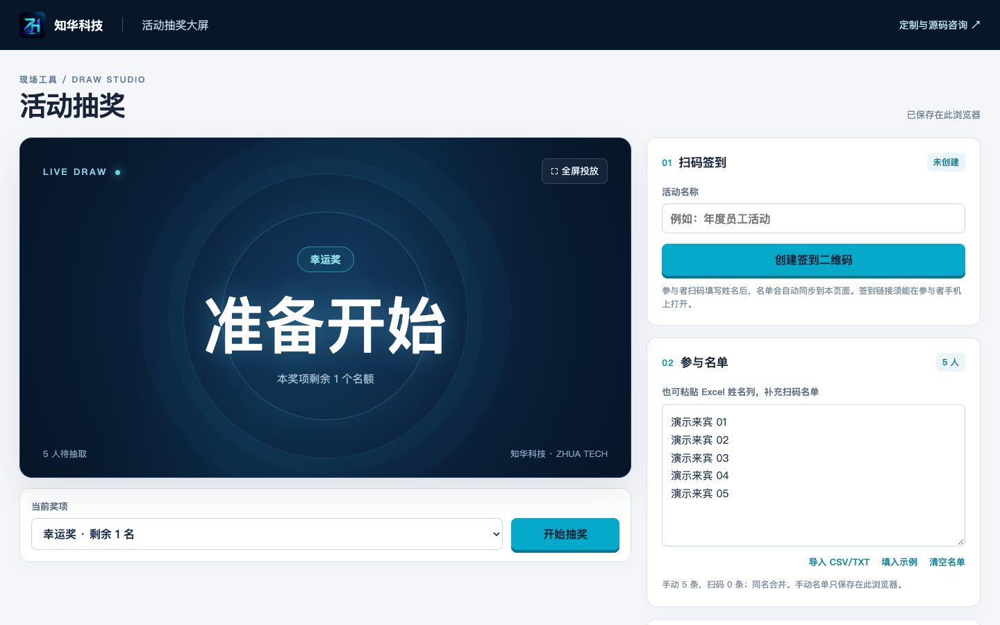
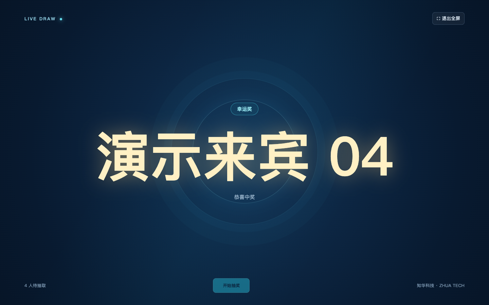
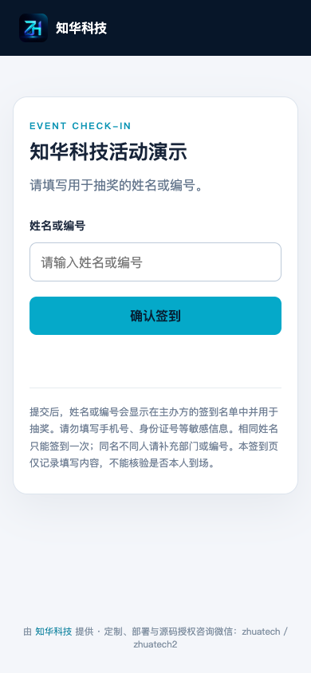

# 知华科技 · 活动抽奖大屏

知华科技（上海如静知华信息科技有限公司）提供活动扫码签到与现场抽奖工具。主办方创建活动后出示二维码，参与者用手机填写姓名或编号；签到名单自动同步到主办方大屏，也可补充 Excel 姓名列或 CSV/TXT 名单。

**在线试用：** [打开知华活动抽奖大屏](https://zhuatech-event-lottery.zhh260417.chatgpt.site/)。主办方可创建活动，用另一部手机扫描签到二维码，确认名单同步后进行抽奖。网页工具可免费使用；请勿在试用活动中填写手机号、身份证号等敏感信息。活动结束后请先导出结果，再删除活动。

**国内访问提示：** 当前在线试用地址在国内手机上需要 VPN，扫码进入该试用站的签到页也需要 VPN。按下文授权范围将源码部署到国内可访问的服务器后，参与者访问自行部署的地址无需 VPN。正式活动前请用参与者手机验证。

**商业合作：** 需要源码商业授权、企业专属视觉、独立部署或系统集成，可通过[知华科技项目咨询](https://www.zhuatech.cn/contact.html)联系，并注明“活动抽奖大屏”。

## 界面预览

以下图片使用虚构演示数据。参与者手机签到页由主办方创建活动后，通过签到二维码打开。



| 现场抽奖大屏 | 参与者手机签到 |
| --- | --- |
|  |  |

## 功能

- 扫码自助签到、同名合并、结束或重新开放签到；主办方可删除活动及服务器上的签到记录。每场最多 2,000 人。
- 最多设置 20 个奖项，随机抽取且不重复中奖；全屏投放、导出中奖 CSV。
- 自选大屏主题，或上传 JPG/PNG/WebP 背景图并调整位置与压暗程度。背景图只保存在当前浏览器。
- 手动名单、奖项和中奖结果保存在主办方当前浏览器；扫码签到记录保存在活动服务中。活动链接有效期为 30 天，过期后不能继续访问；活动结束后可主动删除。

扫码签到由参与者自行填写，不核验到场身份。相同姓名只能签到一次，同名不同人请补充部门或编号。参与者不应填写手机号、身份证号等敏感信息。

## 本地运行

需要 Node.js 24 或更高版本。运行：

```sh
npm run dev
```

打开 `http://127.0.0.1:4173/`。本地预览使用项目目录内的 `.local/events.sqlite` 保存测试签到记录；手机不能通过自身的 `127.0.0.1` 扫码访问电脑上的预览页。供参与者扫码时，应把站点部署到参与者手机可访问的地址。仅本人可访问的私有预览不能用于外部现场签到。

检查代码和功能：

```sh
npm run lint
npm test
npm run build
```

详细步骤见 [操作手册](docs/操作手册.md)。站点的服务端使用 D1 数据绑定 `DB`；部署时应将数据库绑定命名为 `DB`，无需在仓库提交真实密钥。

## 数据与授权

主办方当前浏览器保存手动名单、奖项、中奖结果和活动管理凭证。换设备或清理浏览器数据后，这些内容和管理权限可能无法恢复；活动结束后请先导出结果，再删除活动。扫码签到名单通过活动服务供持有管理凭证的主办方获取，签到链接本身不包含管理凭证。背景图片不上传服务器。

知华科技运营的网页工具可免费使用。公开的源码为**社区源码版**，知华科技自有代码按 [LICENSE](LICENSE) 仅许可自然人用于个人学习、研究和非商业交流；企业内部生产、商业性独立部署、SaaS、收费交付等商业用途，须先联系知华科技取得书面授权。网页使用权不包含源码商用权。企业专属大屏视觉、部署、系统集成和源码商业授权均可咨询。第三方二维码库适用其原有 MIT 许可，见 [NOTICE](NOTICE) 和 [第三方声明](dist/vendor/THIRD_PARTY_NOTICES.txt)。

## 联系知华科技

- 官网：[www.zhuatech.cn](https://www.zhuatech.cn/)
- 项目咨询：[联系知华科技](https://www.zhuatech.cn/contact.html)
- 商业授权、定制开发、部署与系统集成咨询微信：`zhuatech`、`zhuatech2`

| 微信 zhuatech | 微信 zhuatech2 |
| --- | --- |
|  |  |
